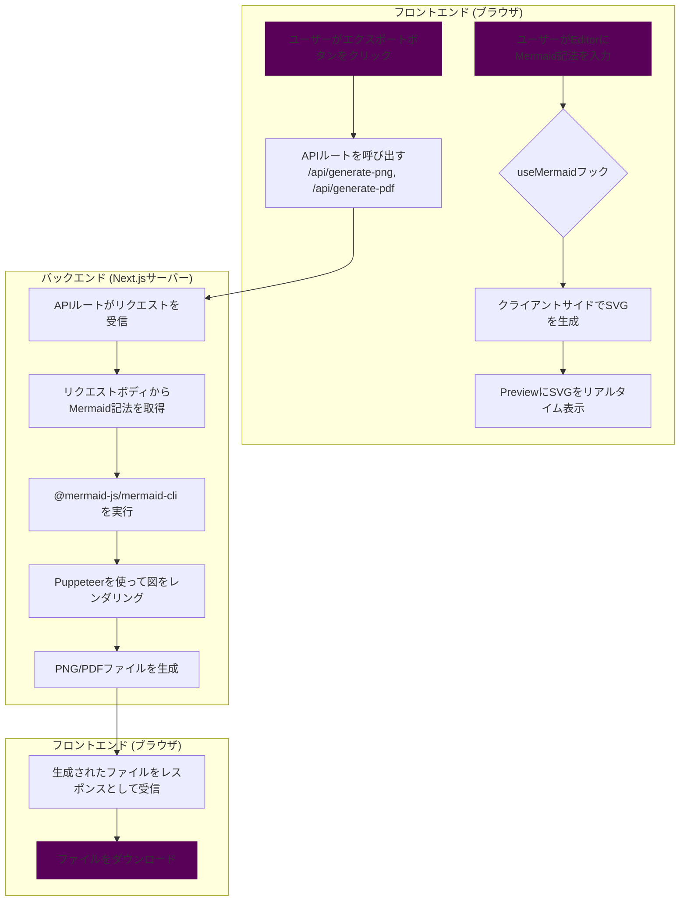

# Mermaid Diagram Exporter (Web App)  


## 概要

[Mermaid](https://mermaid-js.github.io/mermaid/#/) で記述されたフロー図やダイアグラムを、PNG, SVG, PDF画像として簡単にエクスポートしたり、クリップボードにコピーしたりするためのWebアプリケーションです。

JOBフロー図などの視覚化されたプロセスを、ドキュメントやプレゼンテーションに簡単に貼り付けられる形式で保存することを目的としています。

## 主な機能

- **高機能エディタ**: シンタックスハイライトや自動補完が効くMonaco Editorを搭載。
- **サンプルコード**: フローチャート、シーケンス図、ガントチャートなどのサンプルをドロップダウンから簡単に挿入できます。
- **自動ライブプレビュー**: 入力されたコードを即座にレンダリングし、プレビューを自動更新します。**プレビューの背景は常に明るい色（薄いグレー）に固定され、視認性を確保します。**
- **テーマ選択**: `default`, `dark`, `forest`, `neutral` などのテーマを切り替えて、ダイアグラムの見た目を変更できます。**このテーマは主にエクスポートされる画像に適用されます。**
- **多彩なエクスポート形式**: レンダリングされたダイアグラムを、**SVG**, **PNG**, **PDF**形式でダウンロードできます。
- **クリップボードへのコピー**: プレビュー画像を直接クリップボードにコピーして、他のアプリケーションに簡単に貼り付けられます。
- **高解像度出力**: PNGやクリップボードへのコピー時に、解像度（スケール）を選択して、鮮明な画像を出力できます。

## 使い方

1. アプリケーションのURLにアクセスします。
2. 左側のエディタにMermaid形式のコードを入力するか、上部の **「サンプル」** ドロップダウンから好きな図を選択します。
3. コードを編集すると、右側のプレビューエリアが自動で更新されます。
4. 上部のドロップダウンメニューから、お好みの **エクスポートテーマ** や **エクスポート解像度** を選択します。
5. **「SVG保存」**, **「PDF保存」**, **「PNG保存」** ボタンをクリックすると、各種形式で画像ファイルがダウンロードされます。
6. **「コピー」** ボタンをクリックすると、プレビュー画像がクリップボードにコピーされます。

## 技術スタック

- **フレームワーク**: [Next.js](https://nextjs.org/) (React)
- **UI**: [shadcn/ui](https://ui.shadcn.com/), [Tailwind CSS](https://tailwindcss.com/)
- **言語**: [TypeScript](https://www.typescriptlang.org/)
- **ダイアグラムレンダリング**: [Mermaid.js](https://mermaid-js.github.io/mermaid/#/)
- **PNG/PDF生成**: [@mermaid-js/mermaid-cli](https://github.com/mermaid-js/mermaid-cli)
- **コードエディタ**: [Monaco Editor](https://microsoft.github.io/monaco-editor/)
- **アイコン**: [Lucide React](https://lucide.dev/)
- **通知**: [Sonner](https://sonner.emilkowal.ski/)
- **テーマ管理**: [next-themes](https://github.com/pacocoursey/next-themes)

## 処理フロー

このアプリケーションの主要な処理フローは以下の通りです。



## プロジェクト構造

リファクタリングにより、コードベースは役割ごとに分割されています。

- `app/` - Next.jsのApp Router。アプリケーションのエントリーポイント(`page.tsx`)とAPIルート(`api/`)が含まれます。
- `components/` - UIコンポーネント。
  - `ui/` - `shadcn/ui`によって自動生成された基本的なUI部品（Button, Cardなど）。
  - `app/` - アプリケーション固有の複合コンポーネント（Header, ControlPanelなど）。
- `hooks/` - カスタムフック。`use-mermaid.ts`に状態管理とビジネスロジックが集約されています。
- `lib/` - `shadcn/ui`が使用するユーティリティ関数が含まれます。

## ローカルでの開発方法

### 前提条件

- [Node.js](https://nodejs.org/) (LTS版を推奨) がインストールされていること。

### 手順

1.  **依存関係のインストール**
    プロジェクトのルートディレクトリで以下のコマンドを実行し、必要なライブラリをインストールします。
    ```bash
    npm install
    ```

2.  **開発サーバーの起動**
    インストール完了後、以下のコマンドで開発サーバーを起動します。
    ```bash
    npm run dev
    ```

3.  ブラウザで `http://localhost:3000` を開きます。

## 既知の問題と今後の課題

### Vercel環境でのPNG/PDF生成エラー

現在、Vercelにデプロイされた環境において、PNG保存、PDF保存、およびクリップボードへのコピー機能がランタイムエラーで失敗します。（SVG保存は正常に動作します。）

- **問題**:
  サーバーレス関数（APIルート）の実行時に、画像生成に必要な `@mermaid-js/mermaid-cli` の実行ファイルが見つからない (`MODULE_NOT_FOUND`) エラーが発生します。

- **経緯と試したこと**:
  この問題を解決するため、以下のアプローチを試みましたが、いずれも成功しませんでした。
  1.  `package.json` の依存関係を修正し、Vercel環境でPuppeteerが動作するように設定。
  2.  `vercel.json` の `includeFiles` を使用し、`node_modules` 内の `mmdc` 関連ファイルを含めるよう指定。
  3.  `mmdc` 関連ファイルを `node_modules` からプロジェクト内の `lib/mmdc-bin` ディレクトリに手動でコピーし、`includeFiles` でそのディレクトリを指定。

  上記3の段階まで進めても、Vercelの実行環境にファイルが配置されず、エラーが解消されませんでした。ローカル環境では正常に動作するため、Vercelのビルド・バンドルプロセスに起因する問題である可能性が非常に高いです。

- **推奨される次のステップ**:
  1.  **Vercelサポートへの問い合わせ**: この問題の経緯を伝え、`includeFiles` が期待通りに動作しない件について問い合わせることを推奨します。
  2.  **アーキテクチャの変更**: `@mermaid-js/mermaid-cli` への依存をやめ、別の方法で画像生成を行う。例えば、クライアントサイドで生成したSVGをサーバーに送り、`sharp` などのライブラリを使ってPNGに変換する、といった代替案が考えられます。ただし、これは大幅なアーキテクチャ変更を伴います。