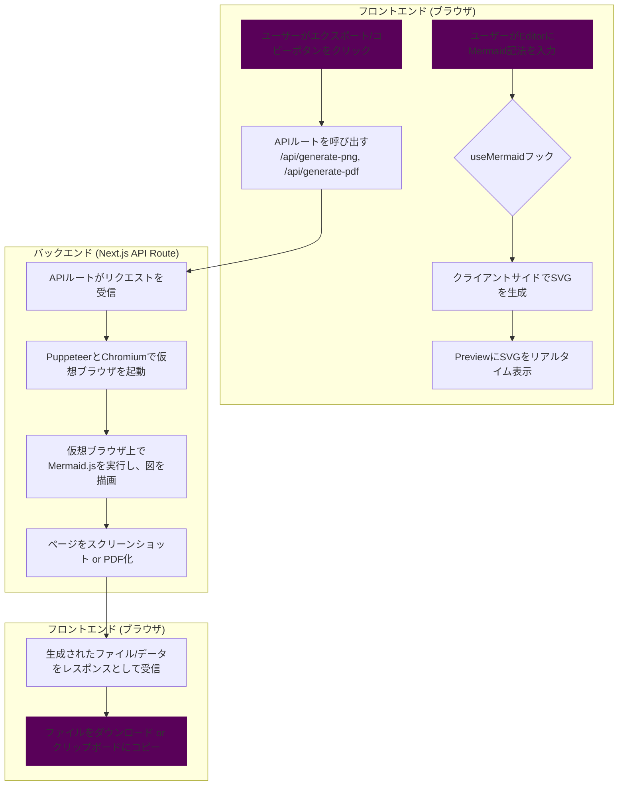

# Mermaid Diagram Exporter (Web App)  


## 概要

[Mermaid](https://mermaid-js.github.io/mermaid/#/) で記述されたフロー図やダイアグラムを、PNG, SVG, PDF画像として簡単にエクスポートしたり、クリップボードにコピーしたりするためのWebアプリケーションです。

JOBフロー図などの視覚化されたプロセスを、ドキュメントやプレゼンテーションに簡単に貼り付けられる形式で保存することを目的としています。

## 主な機能

- **高機能エディタ**: シンタックスハイライトや自動補完が効くMonaco Editorを搭載。
- **サンプルコード**: フローチャート、シーケンス図、ガントチャートなどのサンプルをドロップダウンから簡単に挿入できます。
- **自動ライブプレビュー**: 入力されたコードを即座にレンダリングし、プレビューを自動更新します。**プレビューの背景は常に明るい色（薄いグレー）に固定され、視認性を確保します。**
- **テーマ選択**: `default`, `dark`, `forest`, `neutral` などのテーマを切り替えて、ダイアグラムの見た目を変更できます。**このテーマは主にエクスポートされる画像に適用されます。**
- **多彩なエクスポート形式**: レンダリングされたダイアグラムを、**SVG**, **PNG**, **PDF**形式でダウンロードできます。
- **クリップボードへのコピー**: プレビュー画像を直接クリップボードにコピーして、他のアプリケーションに簡単に貼り付けられます。
- **高解像度出力**: PNGやクリップボードへのコピー時に、解像度（スケール）を選択して、鮮明な画像を出力できます。

## 使い方

1. アプリケーションのURLにアクセスします。
2. 左側のエディタにMermaid形式のコードを入力するか、上部の **「サンプル」** ドロップダウンから好きな図を選択します。
3. コードを編集すると、右側のプレビューエリアが自動で更新されます。
4. 上部のドロップダウンメニューから、お好みの **エクスポートテーマ** や **エクスポート解像度** を選択します。
5. **「SVG保存」**, **「PDF保存」**, **「PNG保存」** ボタンをクリックすると、各種形式で画像ファイルがダウンロードされます。
6. **「コピー」** ボタンをクリックすると、プレビュー画像がクリップボードにコピーされます。

## 技術スタック

- **フレームワーク**: [Next.js](https://nextjs.org/) (React)
- **UI**: [shadcn/ui](https://ui.shadcn.com/), [Tailwind CSS](https://tailwindcss.com/)
- **言語**: [TypeScript](https://www.typescriptlang.org/)
- **ダイアグラムレンダリング**: [Mermaid.js](https://mermaid-js.github.io/mermaid/#/) (クライアントサイド), [Puppeteer](https://pptr.dev/) (サーバーサイド)
- **PNG/PDF生成**: [puppeteer-core](https://pptr.dev/), [@sparticuz/chromium](https://github.com/Sparticuz/chromium)
- **コードエディタ**: [Monaco Editor](https://microsoft.github.io/monaco-editor/)
- **アイコン**: [Lucide React](https://lucide.dev/)
- **通知**: [Sonner](https://sonner.emilkowal.ski/)
- **テーマ管理**: [next-themes](https://github.com/pacocoursey/next-themes)

## 処理フロー

このアプリケーションの主要な処理フローは以下の通りです。



## プロジェクト構造

リファクタリングにより、コードベースは役割ごとに分割されています。

- `app/` - Next.jsのApp Router。アプリケーションのエントリーポイント(`page.tsx`)とAPIルート(`api/`)が含まれます。
- `components/` - UIコンポーネント。
  - `ui/` - `shadcn/ui`によって自動生成された基本的なUI部品（Button, Cardなど）。
  - `app/` - アプリケーション固有の複合コンポーネント（Header, ControlPanelなど）。
- `hooks/` - カスタムフック。`use-mermaid.ts`に状態管理とビジネスロジックが集約されています。
- `lib/` - `shadcn/ui`が使用するユーティリティ関数が含まれます。

## ローカルでの開発方法

### 前提条件

- [Node.js](https://nodejs.org/) (LTS版を推奨) がインストールされていること。

### 手順

1.  **依存関係のインストール**
    プロジェクトのルートディレクトリで以下のコマンドを実行し、必要なライブラリをインストールします。
    ```bash
    npm install
    ```

2.  **開発サーバーの起動**
    インストール完了後、以下のコマンドで開発サーバーを起動します。
    ```bash
    npm run dev
    ```

3.  ブラウザで `http://localhost:3000` を開きます。

## 課題と経緯

### 【解決済み】Vercel環境でのPNG/PDF生成エラー

当初、PNG/PDF生成に`@mermaid-js/mermaid-cli`を利用していましたが、このライブラリがVercelのサーバーレス環境で動作しないという問題がありました。

この問題を解決するため、クライアントサイドでの画像生成など複数のアプローチを試みましたが、ブラウザ間の互換性やライブラリの不安定さにより、いずれも完全な解決には至りませんでした。

最終的に、サーバーサイドで動作するライブラリを、Vercel環境と互換性の高い`puppeteer-core`および`@sparticuz/chromium`に切り替えることで、この問題を解決しました。また、ローカル開発環境とVercel本番環境の両方で安定して動作するよう、環境に応じたブラウザ実行環境の切り替えロジックを導入しています。

### 【未解決】クリップボードへのコピー機能の不具合

- **問題**:
  現在、一部のブラウザ環境において、「コピー」ボタンを押すと「コピーしました」という成功メッセージが表示されるにも関わらず、実際にはクリップボードに画像が書き込まれない（貼り付けができない）という「サイレントフェイル」現象が確認されています。

- **原因の推測**:
  サーバーから返される画像データ自体は正常であることが確認できています。そのため、この問題はアプリケーションのコードに起因するものではなく、ブラウザのセキュリティポリシーや、OSとブラウザ間のクリップボード連携における稀な不具合である可能性が極めて高いと考えられます。

- **代替策**:
  この問題はアプリケーションコードでの解決が困難なため、代替手段として、一度 **「PNG保存」** ボタンで画像をPCにダウンロードし、そのファイルを直接コピー＆ペーストしていただく方法を推奨します。