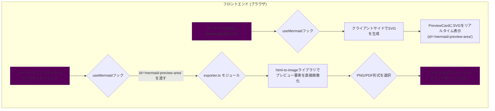

# Mermaid Diagram Exporter (Web App)  


## 概要

[Mermaid](https://mermaid-js.github.io/mermaid/#/) で記述されたフロー図やダイアグラムを、PNG, SVG, PDF画像として簡単にエクスポートしたり、クリップボードにコピーしたりするためのWebアプリケーションです。

JOBフロー図などの視覚化されたプロセスを、ドキュメントやプレゼンテーションに簡単に貼り付けられる形式で保存することを目的としています。

## 主な機能

- **高機能エディタ**: シンタックスハイライトや自動補完が効くMonaco Editorを搭載。
- **サンプルコード**: フローチャート、シーケンス図、ガントチャートなどのサンプルをドロップダウンから簡単に挿入できます。
- **自動ライブプレビュー**: 入力されたコードを即座にレンダリングし、プレビューを自動更新します。**プレビューの背景は常に明るい色（薄いグレー）に固定され、視認性を確保します。**
- **テーマ選択**: `default`, `dark`, `forest`, `neutral` などのテーマを切り替えて、ダイアグラムの見た目を変更できます。**このテーマは主にエクスポートされる画像に適用されます。**
- **多彩なエクスポート形式**: レンダリングされたダイアグラムを、**SVG**, **PNG**, **PDF**形式でダウンロードできます。
- **クリップボードへのコピー**: プレビュー画像を直接クリップボードにコピーして、他のアプリケーションに簡単に貼り付けられます。
- **高解像度出力**: PNGやクリップボードへのコピー時に、解像度（スケール）を選択して、鮮明な画像を出力できます。

## 使い方

1. アプリケーションのURLにアクセスします。
2. 左側のエディタにMermaid形式のコードを入力するか、上部の **「サンプル」** ドロップダウンから好きな図を選択します。
3. コードを編集すると、右側のプレビューエリアが自動で更新されます。
4. 上部のドロップダウンメニューから、お好みの **エクスポートテーマ** や **エクスポート解像度** を選択します。
5. **「SVG保存」**, **「PDF保存」**, **「PNG保存」** ボタンをクリックすると、各種形式で画像ファイルがダウンロードされます。
6. **「コピー」** ボタンをクリックすると、プレビュー画像がクリップボードにコピーされます。

## 技術スタック

- **フレームワーク**: [Next.js](https://nextjs.org/) (React)
- **UI**: [shadcn/ui](https://ui.shadcn.com/), [Tailwind CSS](https://tailwindcss.com/)
- **言語**: [TypeScript](https://www.typescriptlang.org/)
- **ダイアグラムレンダリング**: [Mermaid.js](https://mermaid-js.github.io/mermaid/#/)
- **PNG/PDF生成 (クライアントサイド)**: [html-to-image](https://github.com/bubkoo/html-to-image), [jsPDF](https://github.com/parallax/jsPDF)
- **コードエディタ**: [Monaco Editor](https://microsoft.github.io/monaco-editor/)
- **アイコン**: [Lucide React](https://lucide.dev/)
- **通知**: [Sonner](https://sonner.emilkowal.ski/)
- **テーマ管理**: [next-themes](https://github.com/pacocoursey/next-themes)

## 処理フロー

現在のアーキテクチャでは、すべての画像生成処理がブラウザ（クライアントサイド）で完結します。ユーザーが見ているプレビュー領域を直接画像化することで、安定した出力を実現しています。



## プロジェクト構造

リファクタリングにより、コードベースは役割ごとに分割されています。

- `app/` - Next.jsのApp Router。アプリケーションのエントリーポイント(`page.tsx`)が含まれます。
- `components/` - UIコンポーネント。
  - `ui/` - `shadcn/ui`によって自動生成された基本的なUI部品（Button, Cardなど）。
  - `app/` - アプリケーション固有の複合コンポーネント（Header, ControlPanelなど）。
- `hooks/` - カスタムフック。`use-mermaid.ts`に状態管理とUIイベントのハンドリングが集約されています。
- `lib/` - ユーティリティ関数とビジネスロジック。
  - `utils.ts` - `shadcn/ui`が使用するユーティリティ関数。
  - `exporter.ts` - SVGからの画像/PDF生成、クリップボードへのコピーといったエクスポート処理を集約したモジュール。

## ローカルでの開発方法

### 前提条件

- [Node.js](https://nodejs.org/) (LTS版を推奨) がインストールされていること。

### 手順

1.  **依存関係のインストール**
    プロジェクトのルートディレクトリで以下のコマンドを実行し、必要なライブラリをインストールします。
    ```bash
    npm install
    ```

2.  **開発サーバーの起動**
    インストール完了後、以下のコマンドで開発サーバーを起動します。
    ```bash
    npm run dev
    ```

3.  ブラウザで `http://localhost:3000` を開きます。

## 課題と経緯

### 【解決済み】Vercel環境でのサーバーサイド実行エラー

- **問題**: 当初、PNG/PDF生成をサーバーサイド(Next.js API Route)でPuppeteerを用いて行っていましたが、Vercelのサーバーレス環境ではChromiumの実行パスの問題が解決できず、デプロイ環境でエクスポート機能が一切動作しないという致命的な問題を抱えていました。
- **解決策**: この問題を根本的に解決するため、アーキテクチャを「完全クライアント生成型」に全面的に刷新しました。サーバーサイドでの処理をすべて撤廃し、ブラウザ上ですべての画像・PDF生成を完結させるように変更しました。これにより、Vercelの実行環境への依存がなくなり、アプリケーションは静的サイトとして安定して動作するようになりました。

### 【解決済み】エクスポート機能の安定化

- **現象**: クライアント生成への移行後、エクスポートした画像で文字が消えたり、画像生成自体に失敗する問題が断続的に発生していました。

- **原因**: 複数の要因が複合的に絡み合っていました。
    1.  **ライブラリとCORSの問題**: 画像生成ライブラリ(`canvg`, `save-svg-as-png`, `html-to-image`)が、ページに読み込まれている外部CSS（Google Fonts, Monaco Editor）を処理しようとして、ブラウザのセキュリティ制限（CORS）に抵触していました。
    2.  **SVGの互換性**: MermaidがデフォルトでHTMLラベル（`<foreignObject>`）を使用しており、これが多くの画像生成ライブラリで正しく解釈されませんでした。
    3.  **不安定なアーキテクチャ**: エクスポートの都度、非表示のDOM要素を裏で生成する方式だったため、タイミングによってレンダリングが不完全になる問題がありました。

- **対策**: 以下の抜本的な修正を行いました。
    1.  **MermaidのSVG生成を改善**: Mermaidの初期化時に`htmlLabels: false`を指定し、互換性の高い標準的なSVGテキスト (`<text>`) を生成するように変更しました。
    2.  **画像生成ライブラリの最適化**: ライブラリを`html-to-image`に統一し、フォント処理をスキップするオプション (`skipFonts: true`) を指定。これにより、CORSエラーを根本的に回避しました。
    3.  **アーキテクチャの刷新**: 裏で要素を生成する方式を廃止し、**画面に表示されているプレビュー領域そのもの**を直接画像化する方式に変更しました。これにより、ユーザーが見ている通りの内容が確実にエクスポートされるようになり、安定性が大幅に向上しました。